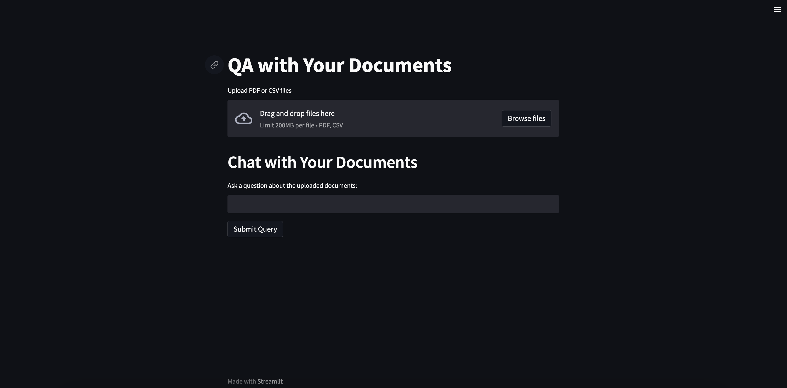

# QA with Your Documents

This project provides an interactive Streamlit-based web application that allows users to upload PDF and CSV files, store their content in a vector database using LangChain and Chroma, and query the uploaded documents using OpenAI's LLMs (e.g., GPT-3.5-turbo). The app intelligently retrieves relevant information from the documents and provides citations for the sources.

---

## Features

- **Upload and Process Documents**:
  - Upload multiple PDF and CSV files.
  - Extract content using LangChain's document loaders.
- **Vector Database Storage**:

  - Store document embeddings in a persistent Chroma vector database.

- **Interactive Query System**:

  - Ask questions about the uploaded documents.
  - Retrieve answers along with source citations.

- **Download Cited Files**:
  - Easily download files cited in the query response.

---

## Technologies Used

- **Streamlit**: For creating the web interface.
- **LangChain**: For document processing and retrieval.
- **Chroma**: As the vector database for storing embeddings.
- **OpenAI API**: For LLM-based query answering.
- **Python**: The core language for building the application.

---

## Installation

### Prerequisites

- Python 3.10 or later
- OpenAI API Key

### Steps

1. **Clone the Repository**:

   ```bash
   git clone git@github.com:stacksapien/smart-doc-search.git
   cd smart-doc-search
   ```

2. **Set Up a Virtual Environment**:

   ```bash
   python3 -m venv env
   source env/bin/activate # On Windows: .\\env\\Scripts\\activate
   ```

3. **Install Dependencies**:

   ```bash
   pip install -r requirements.txt
   ```

4. **Configure Environment Variables**:
   Create a file named `.env` in the root directory and add your OpenAI API key:

   ```
   OPENAI_API_KEY=your_openai_api_key
   ```

5. **Run the Application**:

   ```bash
   streamlit run app.py
   ```

6. **Access the App**:
   Open your browser and navigate to:
   ```
   http://localhost:8501
   ```

---

## Usage

### Upload Files

- Upload one or more PDF or CSV files using the file uploader.
- Uploaded files are processed and stored in the `uploaded_files` directory.

### Ask Questions

- Enter your query in the text box provided.
- The app retrieves relevant answers from the uploaded documents and displays the sources.

### Download Cited Files

- Files cited in the response are available for download.

---

## File Structure

```
smart-doc-search/
│
├── app.py # Main Streamlit application
├── requirements.txt # List of Python dependencies
├── .env # Environment variables (not included in Git)
├── uploaded_files/ # Directory for storing uploaded files
├── chromadb/ # Directory for persistent Chroma vector database
└── README.md # Project documentation
```

---

## Deployment

### Deploy on AWS EC2

1. Launch an Ubuntu EC2 instance and configure security groups to allow inbound traffic on ports 22 and 8501.
2. SSH into the instance and set up Python, Streamlit, and the application as per the installation instructions.
3. Use a process manager like `tmux` or `screen` to keep the app running.

### Use Custom Domain

- Configure a reverse proxy (e.g., Nginx) to serve the Streamlit app under your domain.
- Enable HTTPS using Certbot for SSL certificates.

---

## Contributing

Contributions are welcome! Please follow these steps:

1. Fork the repository.
2. Create a new branch: `git checkout -b feature-name`
3. Commit your changes: `git commit -m "Add feature-name"`
4. Push to the branch: `git push origin feature-name`
5. Submit a pull request.

---

## License

This project is licensed under the MIT License. See the [LICENSE](LICENSE) file for details.

---

## Acknowledgments

- [LangChain](https://langchain.com)
- [Streamlit](https://streamlit.io)
- [Chroma](https://www.trychroma.com)
- [OpenAI](https://openai.com)

---

## Issues

If you encounter any issues or have feature requests, please [open an issue](https://github.com/stacksapien/smart-doc-search/issues).

---

## Screenshots

### Upload Documents



### Query and Get Results


---

## Author

- **Vishal Verma** - [LinkedIn](https://www.linkedin.com/in/stacksapien)

Feel free to reach out with any questions or feedback!
